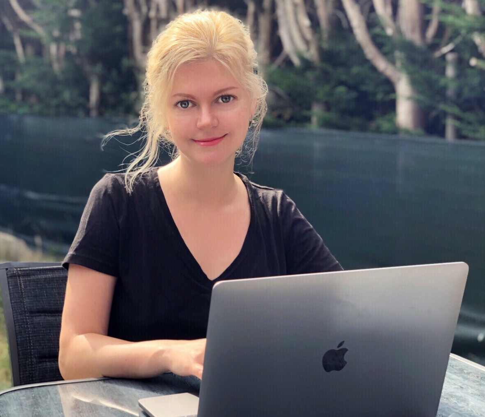

# Yulia Dogrusoz 

#### Currently a student at HYF

## About Me
I’m an enthusiastic person who’s driven by new ideas. I have natural organizational skills which help me to inspire and mobilize people for achieving goals. I’m a quick learner who’s open minded and ready to embrace and adapt the change when it comes in my way.

## Experience
* **Interpreter  Russian - English**   
Chimarus Russia – 2014-2016  
_Providing translation service during business meetings._

* **Graphic Designer Freelance**  
Vitgraf Lipetsk Russia –2000 - 2016  
_Design of vector graphics on softwares like Corel Draw and Adobe Illustrator.  
Using software like Adobe Photoshop for posters and banners._

* **Entrepreneur**  
Lipetsk Russia – 2009- 2017  
_Started a clothing retail shop and worked as a sales person._

* **Teacher of English**  
Lipetsk Russia– 2006-2007  
_Worked as a teacher in elementary school and middle school._

## Education
Lipetsk Pedagogical University – Bachelor 2006

## Skills
>Language   
>Graphic applications   
>Teaching  
>Sales & Marketing

## A Little More About Me
#### My other interests and hobbies are:
>Psychology   
>Literature (I’m a co-author of an unpublished book)  
>Painting  
>Fitness

[My GitHub](https://github.com/julia-sod)

